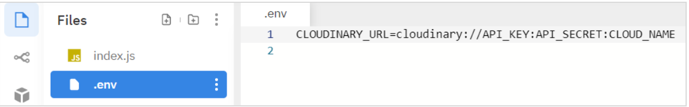
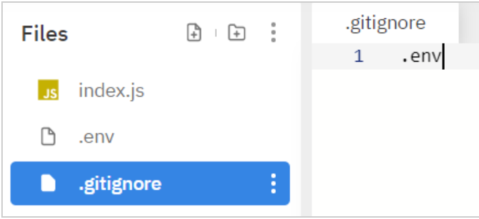

# Upload Media

The instructions given below are solely with reference to the Partner training module "Upload Video". Utilize these instructions to perform the steps demonstrated within the course.

## Prerequisites 

To perform the steps shown in the demonstrations within the course, you will need:  

1. A free Cloudinary account. You can sign up for one here: https://cloudinary.com/users/register/free
2. A GitHub account. This is required only if you want to clone or fork the imported repo. Otherwise, you can simply download the repo without a GitHub account, as long as the repo is public.
3. A [repl.it](https://repli.it) account. This is optional. We have used repl.it for our demos, but you can choose any IDE (independent development environment) of your choice.   
However, the below steps are specifically for carrying out within repl.it.  
You'll find the source for the Upload Video instruction in this repository.  You can find the code for the delivery of video in an eCommerce web page using the  Product Gallery widget here: https://github.com/cloudinary-training/cld-bd-product-gallery


##  Importing GitHub Repos into repl.it    

In one of the repl.it instances, import the code for this repo: https://github.com/cloudinary-training/cld-bd-upload-media. 
To import the repo:    

a. In your repl.it account, click the New repl button on the top left.    
b. Select the Import from GitHub tab, as shown below.    
c. Copy-paste the repo link in the Paste any repository URL field.   


 

### Note
The eCommerce web page is the front-end or the client-side, whereas the upload functionality is a back-end project which runs on node.js. Both projects can run JavaScript. Yet, the web page or browser JavaScript and the node.js server JavaScript each have some unique features. To put them both together in a single repl.it instance would require full stack functionality, which means that it can run from the server to the browser. 

## Setting up the Upload API (Uploader Function) in repl.it Environment  
Make sure you have imported the GitHub repo of the uploader function: https://github.com/cloudinary-training/cld-bd-upload-media  

1. On the top of the left panel, click the Add file option.
2. Name the file .env.  
3. Navigate to your Cloudinary account.
4. Select the Dashboard tab on the top.  
5. Under Account Details, copy the API Environment variable. You can copy it by clicking the Copy to clipboard link adjacent to the variable.
6. Now, back in the uploader repl.it, select the .env file.
7. Paste the API Environment variable within the .env file.  

You should now be able to view your Cloudinary_URL which includes the API Key, API Secret and the cloud name of your account. Typically, it should look like this:




8. Then, select the Shell tab and install NPM packages before running scripts. 

```bash
npm i
```

9. Finally, click the Run button on the top. It might take a few moments for the code to be executed. 

10. To review the response, click the Console tab next to the Shell tab.
Once done, visit your Cloudinary account once again to verify if the upload was successful. 

Note:  
If you want to fork this code, you must ensure that you don't accidentally check in the .env to your own GitHub. A way to do this is to add a `.gitignore` file and then add .env to it. The `.gitignore` file lists any files you don't want checked into GitHub, such as the `.env` file. 
Given below is an example:



### Clouindary Upload API code
You'll find the Upload API code in the `index.js` file.


### Additional Resources

[How to integrate Cloudinary into your application](https://cloudinary.com/documentation/how_to_integrate_cloudinary) 

[Upload API](https://cloudinary.com/documentation/image_upload_api_reference) 

[Uploading Assets](https://cloudinary.com/documentation/upload_images)  

[Upload Presets](https://cloudinary.com/documentation/upload_presets)  

[Product Gallery Demo](https://demo.cloudinary.com/product-gallery/)  

[Metadata API](https://cloudinary.com/documentation/metadata_api)  

[Eager Transformation](https://cloudinary.com/documentation/transformations_on_upload#eager_transformations)  

[Upload Widget API reference](https://cloudinary.com/documentation/upload_widget_reference) 

[Media Library](https://cloudinary.com/documentation/media_library_widget)  

[Product Gallery](https://cloudinary.com/documentation/product_gallery)  

[Product Gallery API](https://cloudinary.com/documentation/product_gallery_reference)  

[DOMContentLoaded event](https://developer.mozilla.org/en-US/docs/Web/API/Window/DOMContentLoaded_event)  

[Video Player](https://cloudinary.com/documentation/cloudinary_video_player)  

[Video transformation API](https://cloudinary.com/documentation/video_transformation_reference)  

[Video Player API](https://cloudinary.com/documentation/video_player_api_reference)  

[Video Player Studio](https://studio.cloudinary.com/)  

[Cloudinary SDKs](https://cloudinary.com/documentation/cloudinary_sdks)


